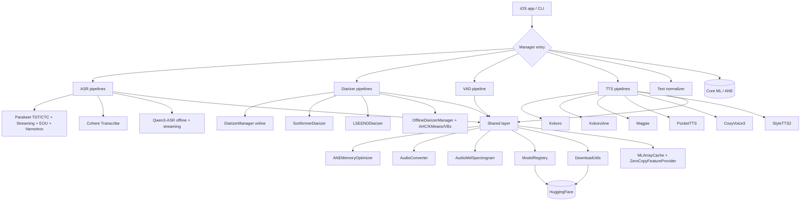

# FluidAudio — Architecture Overview

## TL;DR
FluidAudio is Audria's Swift SDK for fully local, low-latency audio AI on Apple devices, with all inference offloaded to the Apple Neural Engine (ANE) via Core ML. The package (414 Swift files, ~109k LOC) ships six subsystems — ASR (Parakeet TDT/CTC + streaming + EOU + Nemotron, Cohere, Qwen3), Diarization (Online DiarizerManager, Sortformer, LS-EEND, Offline AHC/KMeans/VBx), VAD (Silero), TTS (Kokoro, KokoroAne, Magpie, PocketTTS, CosyVoice3, StyleTTS2 + SSML + multilingual G2P), ITN (TextNormalizer), and a Shared layer of ANE memory utilities, audio conversion, mel-spectrogram, model registry, and HuggingFace download utilities. Models are auto-downloaded from `huggingface.co/FluidInference/*` and compiled to `.mlmodelc` at first run.

## What This Repo Is
The on-device audio brain that the Audria iOS client and third-party Apple apps embed. It is the source of truth for every speech-related capability that runs without a network round-trip: speaker diarization, transcription, voice activity detection, end-of-utterance detection, speech synthesis, and inverse text normalization. The repo also ships a `FluidAudioCLI` target with benchmarks and offline drivers for every pipeline. There are no third-party Swift dependencies in the library target; FastCluster (C++) and a single mach_task_self() bridge are vendored locally.

## High-Level Architecture

## Subsystems

For each, a single sentence + canonical feature.md link. Per-feature detail lives in `ssot/bootstrap/features/`.

- **Top-level + shared** — [[model-registry]], [[download-utils]], [[model-names]], [[ane-memory-optimizer]], [[audio-converter]], [[audio-mel-spectrogram]], [[mlarray-cache]], [[zerocopy-feature-provider]], [[mlmodel-prediction]], [[mlmultiarray-extensions]], [[mlmodel-configuration-utils]], [[asset-downloader]], [[audio-source-abstraction]], [[audio-stream]], [[app-logger]], [[performance-metrics]], [[progress-emitter]], [[string-utils]], [[system-info]], [[token-language-filter]], [[model-warmup]], [[asr-constants]], [[fluidaudio-umbrella]].
- **ASR — Parakeet (batch)** — [[sliding-window-asr-manager]], [[sliding-window-asr-session]], [[tdt-decoder]], [[ctc-decoder]], [[parakeet-tokenizer]], [[parakeet-model-variant]], [[parakeet-language-models]], [[asr-types]], [[audio-buffer]], [[punctuation-commit-layer]].
- **ASR — Parakeet (streaming)** — [[streaming-asr-manager]], [[rnnt-decoder]], [[encoder-cache-manager]], [[streaming-asr-utils]], [[eou-detector]], [[nemotron-streaming]], [[token-deduplication]].
- **ASR — Custom vocabulary** — [[custom-vocabulary-bk-tree]], [[custom-vocabulary-word-spotting]], [[custom-vocabulary-rescorer]].
- **ASR — Cohere + Qwen3** — [[cohere-asr-pipeline]], [[cohere-asr-config]], [[qwen3-asr-manager]], [[qwen3-asr-streaming-manager]], [[qwen3-asr-models]], [[qwen3-asr-config]], [[qwen3-rope]], [[whisper-mel-spectrogram]].
- **Diarizer (online)** — [[diarizer-manager]], [[diarizer-models]], [[diarizer-types]], [[speaker-manager]], [[speaker-operations]], [[speaker-types]], [[embedding-extractor]], [[segmentation-processor]], [[segmentation-sliding-window]], [[audio-validation]].
- **Diarizer (Sortformer)** — [[sortformer-diarizer]], [[sortformer-model-inference]], [[sortformer-state-updater]], [[sortformer-types]].
- **Diarizer (LS-EEND)** — [[lseend-diarizer]], [[lseend-inference]], [[lseend-preprocessor]], [[lseend-types]].
- **Diarizer (offline batch)** — [[offline-diarizer-manager]], [[offline-diarizer-models]], [[offline-diarizer-types]], [[offline-segmentation]], [[offline-extraction]], [[offline-utils]], [[ahc-clustering]], [[kmeans-clustering]], [[vbx-clustering]], [[speaker-count-constraints]], [[fastcluster-bridge]].
- **VAD** — [[vad-manager]], [[vad-types]].
- **TTS — Kokoro** — [[kokoro-tts-manager]], [[kokoro-pipeline]], [[kokoro-custom-lexicon]], [[kokoro-ane]].
- **TTS — Magpie** — [[magpie-tts-manager]], [[magpie-local-transformer]], [[magpie-pipeline]], [[magpie-types]], [[magpie-constants]].
- **TTS — PocketTTS** — [[pocket-tts-manager]], [[pocket-tts-pipeline]], [[pocket-tts-tokenizer]].
- **TTS — CosyVoice3** — [[cosyvoice3-tts-manager]], [[cosyvoice3-pipeline-preprocess]], [[cosyvoice3-pipeline-synthesize]], [[cosyvoice3-models]], [[cosyvoice3-shared]].
- **TTS — StyleTTS2 + shared** — [[style-tts2]], [[tts-backend-protocol]], [[audio-post-processor]], [[tts-compute-unit-preset]].
- **TTS — G2P + SSML** — [[multilingual-g2p]], [[ssml-processor]], [[ssml-tag-parser]], [[ssml-types]], [[ssml-say-as-interpreter]].
- **ITN** — [[text-normalizer]].
- **CLI** — [[fluidaudio-cli-bundle]] (bundled; 25k LOC across ~80 subcommand files).

## Request / Pipeline Lifecycles

Six flows worth knowing before navigating the rest:

### 1. Model download + compile + load
Every manager's `initialize()` invokes [[download-utils]] which lists the HuggingFace repo tree via the [[model-registry]] base URL (overridable for self-hosted mirrors), downloads each `.mlmodelc/`/`.json`/`.txt` asset in parallel into the system models directory, then loads the compiled `.mlmodelc` into a long-lived `MLModel` reference held on the manager. See [[model-download-and-load]].

### 2. Batch ASR (Parakeet TDT, the hot path on iOS)
Audio (any sample rate) → [[audio-converter]] resamples to 16 kHz mono Float32 → [[sliding-window-asr-manager]] runs overlapping window inference (15 s / 11.2 s hop) → preprocessor + encoder → [[tdt-decoder]] step loop emitting tokens + durations → [[parakeet-tokenizer]] detokenizes → [[token-deduplication]] merges chunk boundaries → text + per-token timings. See [[batch-asr-parakeet-tdt]].

### 3. Streaming ASR
Mic chunks → [[streaming-asr-manager]] feeds [[encoder-cache-manager]] (rolling encoder state) → [[rnnt-decoder]] emits partials → [[token-deduplication]] handles repeats → emit on each chunk. EOU 120M streaming additionally watches a special token via [[eou-detector]] to publish end-of-utterance events. See [[streaming-asr-parakeet]] and [[streaming-asr-eou]].

### 4. Online diarization
Audio chunk → [[segmentation-processor]] (Pyannote-style sliding-window segmentation) → [[embedding-extractor]] (per-speaker waveform → 192-D embedding) → [[speaker-manager]] (online cosine-similarity against a per-user registry with a configurable threshold) → emit speaker-attributed timeline. See [[online-diarization]].

### 5. Offline batch diarization
Whole-audio input → [[offline-segmentation]] + [[offline-extraction]] concurrent fan-out via `AsyncThrowingStream` → embedding stack → [[ahc-clustering]] for initial assignments → [[vbx-clustering]] refinement with [[fastcluster-bridge]] for the fast linkage step → [[speaker-count-constraints]] enforces upper bounds → final timeline. See [[offline-batch-diarization]].

### 6. TTS — Kokoro (the shipping default)
Text → [[ssml-processor]] (if SSML wrapped) → [[multilingual-g2p]] (charsiu-byt5 byte-level greedy) → [[kokoro-pipeline]] (single-graph 82M model) → [[audio-post-processor]] (biquad cleanup) → audio. See [[kokoro-synthesize]].

## Data & Storage

| Concept | Store | Owning feature |
|---|---|---|
| Model weights (`.mlmodelc`, `.json`, `.txt`) | On-disk under `FileManager` models dir | [[mlmodel-configuration-utils]] |
| HuggingFace repo tree listing | Network-only, no local cache | [[download-utils]] |
| Speaker registry (online) | In-process, in-memory dictionary | [[speaker-manager]] |
| Voiceprint embeddings (192-D Float32) | In-process | [[embedding-extractor]] |
| ANE-aligned input buffers | Pooled via [[ane-memory-optimizer]] | [[ane-memory-optimizer]] |
| Reusable `MLMultiArray`s | LRU-ish reuse | [[mlarray-cache]] |
| Audio assets (per-TTS-engine) | Bundled in repo + downloaded JSON | per-TTS-engine feature.md |

## Cross-Cutting Concerns

- **All inference targets the ANE.** Every predict path goes through [[ane-memory-optimizer]] for 64-byte-aligned input buffers and [[mlmodel-prediction]] for the async wrappers. Misalignment silently falls back to CPU.
- **`@unchecked Sendable` is forbidden** per `CLAUDE.md` / `AGENTS.md`. The 110 feature.md files surfaced zero violations but several `nonisolated(unsafe)` static mutables (set-once at startup, not runtime-guarded) — see [[_self_review]].
- **Model registry overridable** for self-hosted mirrors via `REGISTRY_URL` / `MODEL_REGISTRY_URL` env vars or `ModelRegistry.baseURL = ...` setter ([[model-registry]]).
- **AudioConverter is the single audio entry point** for the library — every manager calls it to coerce input to 16 kHz mono Float32. Non-matching formats round-trip through AVAudioConverter ([[audio-converter]]).
- **Performance philosophy: minimize CPU + skip GPU/MPS entirely.** ANE is the only target. ZeroCopyFeatureProvider + MLArrayCache + ANEMemoryOptimizer compose the perf-critical layer.
- **Magpie is experimental** at this commit — ~0.04 RTFx (25× slower than realtime). README acknowledges. See [[magpie-tts-manager]].
- **StyleTTS2 has elevated WER** (~44%) vs Kokoro (1.3%) on long English. See [[style-tts2]].
- **Qwen3 streaming "re-runs" offline transcribe** on a growing buffer rather than doing KV-cache streaming. See [[qwen3-asr-streaming-manager]] and [[streaming-asr-qwen3]].

## How to Add a New Model

The most common change to this repo is adding a new model variant.

### Add a new ASR model
1. Add the HuggingFace repo path to the `Repo` enum in [Sources/FluidAudio/ModelNames.swift](https://github.com/Audria-tech/FluidAudio/blob/94e54782a613d6ce2ba627e17e930f3107652530/Sources/FluidAudio/ModelNames.swift) and surface its `requiredModels` set.
2. If it's a Parakeet variant, register a `ParakeetModelVariant` case and reuse [[sliding-window-asr-manager]] / [[streaming-asr-manager]]. Otherwise create a new manager (copy [[cohere-asr-pipeline]] or [[qwen3-asr-manager]] as a template) and conform to the manager-API conventions in `AGENTS.md`.
3. Add a `Documentation/ASR/<NewModel>.md` getting-started doc.
4. Add a feature.md to the SSOT bootstrap.
5. Tests via `Tests/FluidAudioTests/`.

### Add a new TTS engine
1. Add the HF repo path to `Repo`.
2. Conform to [[tts-backend-protocol]] and copy the layout of [[kokoro-tts-manager]] (manager + pipeline + assets + constants + error enum).
3. Wire G2P (use [[multilingual-g2p]] unless the engine has its own).
4. Add a `Documentation/TTS/<NewEngine>.md`.

## What This Document Does NOT Cover
- Per-feature behavior — see `ssot/bootstrap/features/`.
- Per-flow step-by-step — see `ssot/bootstrap/flows/`.
- Per-subcommand CLI behavior — bundled into [[fluidaudio-cli-bundle]] stub; see `Documentation/CLI.md` for the user-facing CLI.
- Model conversion pipeline — see `Documentation/ModelConversion.md`.
- Production-readiness concerns — see [[_self_review]] and the SCRUM tickets it surfaces.

## Glossary
- **ANE**: Apple Neural Engine. All Core ML models in FluidAudio target ANE.
- **TDT**: Token-and-Duration Transformer; the Parakeet decoder variant that emits per-token durations.
- **RNNT**: Recurrent Neural Network Transducer; the streaming decoder shape.
- **EOU**: End-of-utterance — special-token detection for streaming ASR.
- **LS-EEND**: Long-Short End-to-End Neural Diarization.
- **AHC / KMeans / VBx**: clustering algorithms used by the offline diarizer.
- **Sortformer**: Streaming diarizer variant.
- **G2P**: Grapheme-to-phoneme — text → phonemes for TTS.
- **SSML**: Speech Synthesis Markup Language.
- **ITN**: Inverse Text Normalization — "two hundred" → "200".
- **RTFx**: Real-Time Factor — audio_duration / synthesis_duration. >1.0 means faster than realtime.
